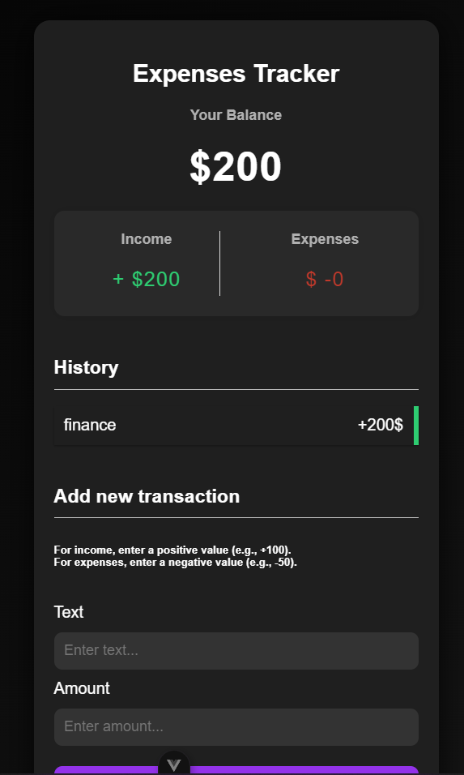

# Vue.js Learning Projects

## Expenses Tracker

A Vue.js application for tracking income and expenses, built with Vue 3 and Composition API.

### Components

#### App.vue (Main Component)
- Root component that manages the overall application state
- Handles transaction data storage and manipulation
- Uses localStorage for data persistence
- Manages the following features:
  - Total balance calculation
  - Income/expense tracking
  - Transaction management (add/delete)

#### Balance.vue
- Displays the current total balance
- Props:
  - `total`: Number (required) - The current balance to display

#### IncomeExpenses.vue
- Shows a summary of total income and expenses
- Props:
  - `income`: Number (required) - Total positive transactions
  - `expense`: Number (required) - Total negative transactions

#### TransactionList.vue
- Displays the history of all transactions
- Features:
  - Lists all transactions with amounts
  - Color coding for income (green) and expenses (red)
  - Delete functionality for each transaction
- Props:
  - `transactions`: Array (required) - List of transaction objects
- Events:
  - `TransactionDeleted` - Emitted when a transaction is deleted

#### AddTransaction.vue
- Form component for adding new transactions
- Features:
  - Input validation
  - Toast notifications for feedback
  - Support for both positive (income) and negative (expense) amounts
- Events:
  - `TransactionSubmitted` - Emitted when a new transaction is added

### Features
- Add and delete transactions
- Automatic balance calculation
- Separate tracking of income and expenses
- Data persistence using localStorage
- Toast notifications for user feedback
- Responsive design

### Project Setup
```bash
# Install dependencies
npm install

# Run development server
npm run dev

# Build for production
npm run build
```

### Technologies Used
- Vue.js 3
- Composition API
- Vue Toastification
- Local Storage API
